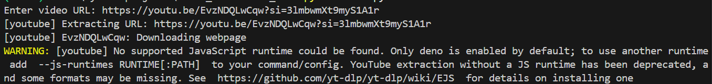

# Video Downloader Bot

## Overview
This project is a Python-based video downloader bot designed with a modular
structure. The application validates user input, processes download requests,
and saves downloaded videos locally.

The logic is separated into dedicated modules to keep the codebase clean,
readable, and easy to extend.

## Screenshots

### Running the application

### Download in progress

### Downloaded files

## How It Works
The program starts execution from `main.py`. User input is first validated using
utility functions to ensure correctness. Once validated, the request is passed
to the downloader module, which handles the video download process.

Downloaded videos are stored in the `videos/` directory. The folder is excluded
from version control to prevent large files from being uploaded to GitHub.

## Project Structure
- `main.py`  
  Entry point of the application. Handles user interaction and program flow.

- `downloader/video_downloader.py`  
  Contains the logic responsible for downloading videos.

- `utils/validator.py`  
  Validates user input before processing download requests.

- `videos/`  
  Stores downloaded video files (ignored by Git).

- `requirements.txt`  
  Lists required Python dependencies.

## How to Run
1. Clone the repository:
git clone https://github.com/Mudassar-Khann/video_downloader_bot.git

2. Navigate to the project directory:

3. Install dependencies:

4. Run the program:

Follow the on screen instructions to download videos.

## Notes
- Downloaded files are saved in the `videos/` folder.
- The `videos/` directory is ignored by Git to keep the repository clean.

## Author
Mudassar Khan
